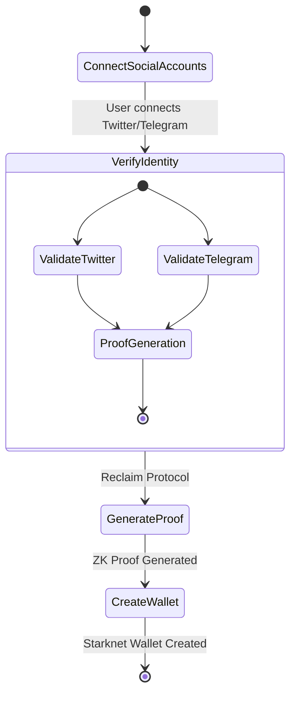
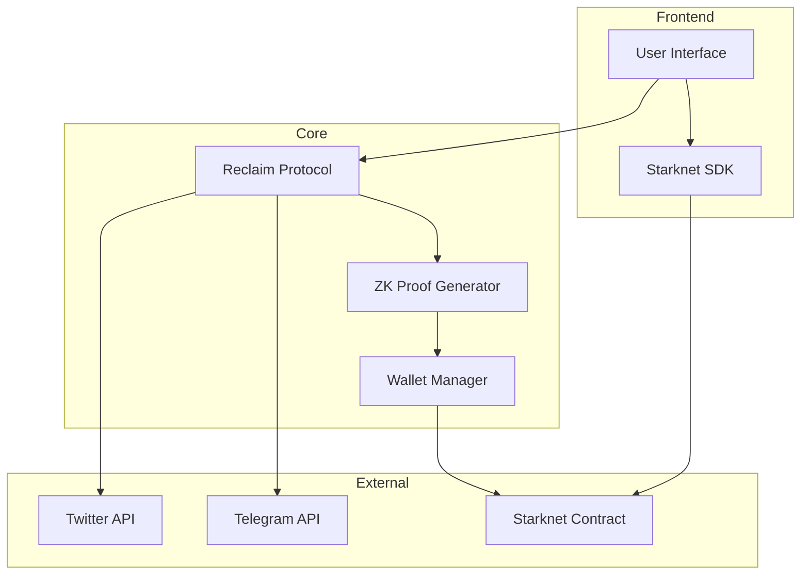
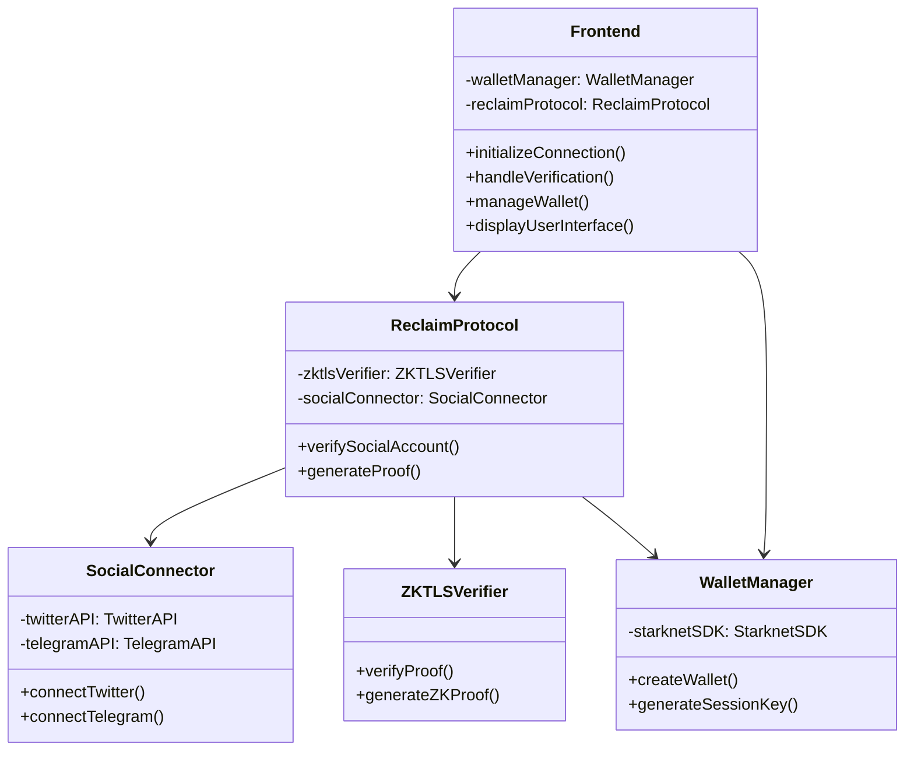
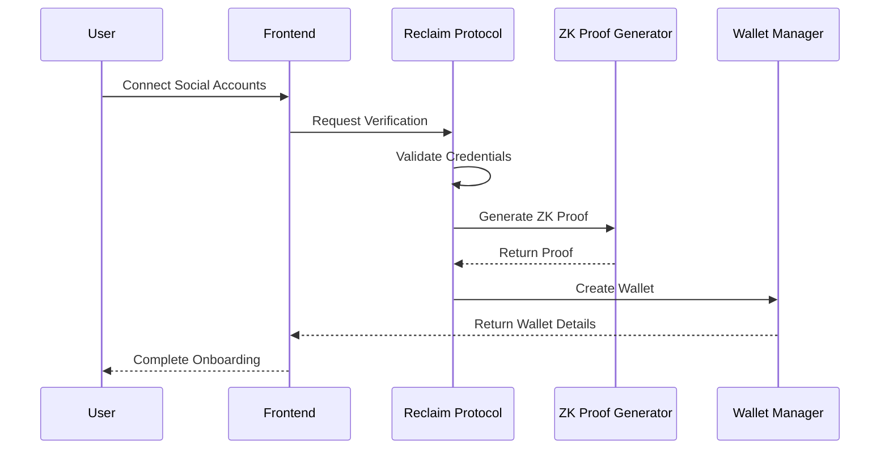

# **Proovacy**  

## **Overview**

Proovacy leverages zkTLS (Zero-Knowledge Transport Layer Security) to privately prove ownership of social media usernames, such as Twitter and Telegram, directly on-chain while ensuring user privacy. By integrating the Starknet Wallet SDK, Proovacy creates a unique wallet based on parameters derived from these platforms. Initially, the system supports verified humans onboarding through Twitter and Telegram, followed by a 2:1 referral model, where each user can invite two verified participants. This decentralized Proof-of-Personhood system not only enables secure verification but also supports generating session keys for privacy-preserving authentication across platforms.

## Demo Video

Watch the demo of our project in action:  

## **Workflows**
### **Activity Diagram**

### **Software Architecture Diagram**

### **Class Diagram**

### **Sequence Diagram**

## **Features**

The Proovacy project is built using the following technologies and protocols:

- **Frontend**  
  Developed with **Next.js**, a React framework for building web applications.

- **Backend**  
  Implemented with **Node.js**, a JavaScript runtime environment for server-side applications.

- **Blockchain**  
  Integrated with **Starknet**, a layer-2 scalability solution for Ethereum. **Cairo**, the programming language specifically designed for Starknet smart contracts, is used to implement on-chain logic and interactions.

- **Reclaim Protocol**  
  Proovacy integrates **Reclaim Protocol**, a decentralized protocol that allows users to prove ownership of accounts, data, or assets from third-party platforms without sharing sensitive credentials.  
  This protocol enables:  
  - **Secure identity verification** using cryptographic proofs.  
  - **Privacy-preserving claims** leveraging ZKPs to ensure user data remains confidential.  
  - **Integration with multiple platforms** to streamline the process of proving account ownership.  

- **Scaffold-Stark Template**  
  Built upon **Scaffold-Stark**, a template designed to assist developers in creating decentralized applications (dApps) on Starknet efficiently.  
  Scaffold-Stark provides:  
  - Pre-built Starknet smart contract examples written in **Cairo**.  
  - An extensible frontend connected to Starknet wallets.  
  - Development tools for testing and deploying smart contracts.  

---

## **Additional Resources**

- [Reclaim Protocol Documentation](https://docs.reclaimprotocol.org/)  
  Learn more about how Reclaim Protocol enables secure and private identity verification.  

- [Scaffold Stark Repository](https://github.com/Scaffold-Stark/scaffold-stark-2)  
  Explore the template repository to build Starknet-based dApps with ease.  

- [Cairo Programming Language Documentation](https://www.cairo-lang.org/docs/)  
  Learn more about **Cairo**, the language for writing smart contracts on Starknet.
